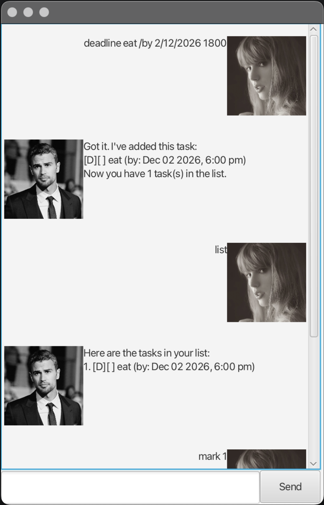

# Theo User Guide


Theo is a simple task manager that helps you manage todos, deadlines, and events using text commands.

## Adding to-dos: `todo`
Adds a simple task without any date or time.

Format: `todo DESCRIPTION`

Example: `todo eat`

## Adding deadlines: `deadline`
Adds a task with a deadline.

Format: `deadline DESCRIPTION /by DATE`
- `DATE` must be in `d/M/YYYY HHmm` format

Example: `deadline eat /by 3/12/2026 1800`

## Adding events: `event`
Adds a task with a start and end time.

Format: `event DESCRIPTION /from START /to END`
- `START` and `END` must be in `d/M/YYYY HHmm` format

Example: `event meeting /from 3/12/2026 1800 /to 3/12/2026 2000`

## Listing tasks
Display all tasks in the list.

Format: `list`

## Marking a task as done
Marks the specified task in the list as done.

Format: `mark INDEX`
- Marks the task at the specified `INDEX` as done.
- The index refers to the index number shown in the displayed task list.
- The index **must be a positive integer** 1, 2, 3, ...

Example: `mark 2`

## Unmarking a task
Marks the specified task in the list as not done.

Format: `unmark INDEX`
- Marks the task at the specified `INDEX` as not done.
- The index refers to the index number shown in the displayed task list.
- The index **must be a positive integer** 1, 2, 3, ...

Example: `unmark 2`

## Deletes a task
Deletes the specified task from the list.

Format: `delete INDEX`
- Deletes the task at the specified `INDEX`.
- The index refers to the index number shown in the displayed task list.
- The index **must be a positive integer** 1, 2, 3, ...

Example: `delete 2`

## Finding a task
Finds tasks with descriptions containing the specified keyword.

Format: `find KEYWORD`
- The search is case-sensitive. e.g. `meet` will not match `Meet`
- The order of the keywords matter. e.g. `team meeting` will not match `meeting team`
- Only the task description is searched.

Example: `find meeting` returns `meeting` and `team meeting`

## Viewing your schedule
Displays all tasks scheduled on a specific date.

Format: `view DATE`
- `DATE` must be in `d/M/YYYY` format
- Deadline tasks will be included if their deadline **has not passed** the specified `DATE`.
- Event tasks will be included if the specified `DATE` **falls within the event’s duration**.

Example: `view 15/2/2026` returns 
```
Schedule for Feb 15 2026:
1. [D][ ] Submit report (by: Feb 20 2026, 11:59 pm)
2. [E][ ] Team meeting (from: Feb 15 2026, 7:00 pm to: Feb 15 2026, 9:00pm)
3. [E][ ] Project workshop (from: Feb 10 2026, 6:00 am to: Feb 20 2026, 12:00pm)
```

## Exiting the program
Exits the program.

Format: `bye`